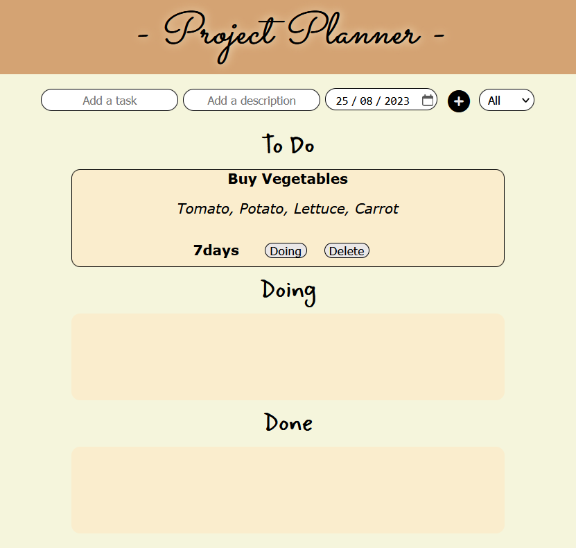

# Project-planner

# Our mission
Our mission for this 3 days trial was to create a tool to manage projects.

This is the list of features we created :
- Allow user to create tasks. Tasks have a name, a description and a due date
- Allow users to label their tasks with a status (ex: to do, doing, done)
- Allow user to delete tasks.
- Display the tasks, with their remaining time. For instance, if today is the 15th of March and the task is due for the 20th of March, display in 5 days.
- Allow users to sort their tasks by remainining time, with the most urgent first, or by name.
- Filter tasks (ex: only show "to do" tasks)
- Save tasks in LocalStorage, so that they persist even when the page is refreshed.

## Learning objectives

- Dynamic DOM manipulation
- Handling of dates
- UX/UI
- Use map and filter function

## Authors

- [@Ethanosaure] (https://github.com/Ethanosaure)
- [@Alexpe77] (https://github.com/Alexpe77)

## Screen shot

